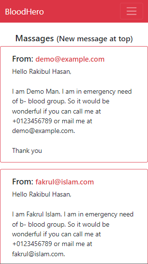

#  BloodHero 
A simple database driven web application. Where
- user can create account 
- log in to account 
- look for required bloodgroup
- message someone

|Desktop View | Mobile View|
|-------------|------------|
|  | |
|  | |
|  |  |
|  | |
|  | |
|  | |